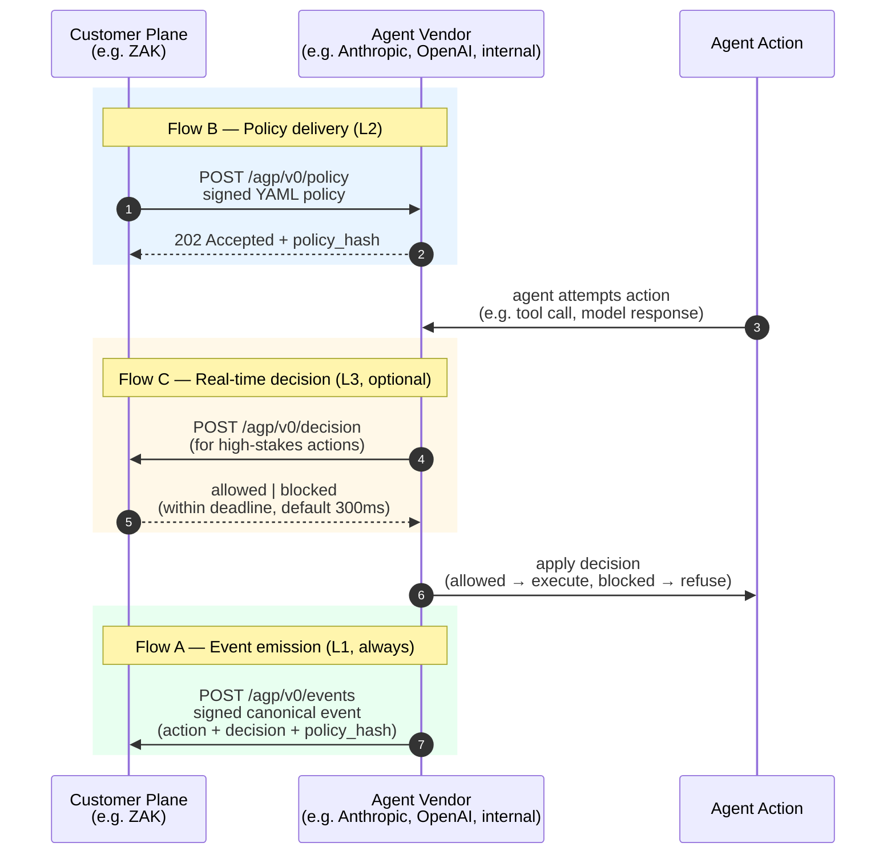

<div align="center">

# OpenAGP

### The open **Agent Governance Protocol**

**Vendor-neutral standard for governing AI agents — what they're allowed to do, who said so, and what they actually did.**

[](https://pypi.org/project/openagp/)
[](https://github.com/openagp/spec/blob/main/concept-and-spec.md)
[](https://creativecommons.org/licenses/by/4.0/)
[](https://www.apache.org/licenses/LICENSE-2.0)

[**Read the spec**](https://github.com/openagp/spec/blob/main/concept-and-spec.md) · [**SDK (Python)**](https://github.com/openagp/sdk-python) · [**SDK (TypeScript)**](https://github.com/openagp/sdk-typescript) · [**Conformance suite**](https://github.com/openagp/cts) · [**Registry**](https://github.com/openagp/registry)

</div>

---

## The problem

Within 18–24 months, a typical large enterprise will run **50–200 AI agents across 10–30 vendors**. Today, every vendor exposes its own audit format, policy surface, and identity model. Customers cannot answer simple compliance questions — *what did our agents do? under what policy? signed by whom?* — without writing N integrations.

This is the same fragmentation problem identity had pre-SAML. The fix is the same shape: **one open protocol, many implementations, one customer-side control plane.**

> The way **SAML** standardized "who is this user" across identity vendors,
> and **MCP** standardized "what tools can an agent call" across model vendors —
> **AGP** standardizes "what an agent is allowed to do, who said so, and what it actually did"
> across every AI agent vendor a customer uses.

## How it works

AGP defines three protocol flows between a customer's **governance plane** and an agent **vendor**. A vendor implements one or more, declaring its **conformance level** (L1, L2, or L3).



**The plane verifies signatures, anchors events into a hash-chained ledger, tags them with regulatory framework controls, and surfaces them to compliance, audit, and runtime.** The vendor stays focused on agents.

## Conformance levels

| Level | What the vendor implements | Capability |
|---|---|---|
| **L1** | Flow A — emit signed events | Passive observability — every agent action is recorded with a verifiable signature |
| **L2** | Flow A + Flow B — accept and apply customer policy | Governance — customer-authored policy is enforced inside the vendor |
| **L3** | Flow A + B + C — real-time decision callback | Synchronous control — high-stakes actions are gated by the customer plane in <300ms |

Vendors advertise their level via a `.well-known/agp` discovery document. Customers can require minimum levels in procurement.

## Repos

| Repo | What's there | Phase |
|---|---|---|
| [`openagp/spec`](https://github.com/openagp/spec) | Protocol spec, JSON Schemas, fixtures, decision records | **Phase 0 — formalization** |
| [`openagp/sdk-python`](https://github.com/openagp/sdk-python) | Reference vendor + plane SDK · `pip install openagp` | Phase 1 — implementation |
| [`openagp/sdk-typescript`](https://github.com/openagp/sdk-typescript) | Reference vendor + plane SDK · `npm install @openagp/sdk` | Phase 1 — implementation |
| [`openagp/cts`](https://github.com/openagp/cts) | Conformance Test Suite — `agp-cts validate-vendor --endpoint …` | Phase 2 — pending |
| [`openagp/registry`](https://github.com/openagp/registry) | Public directory of AGP-compliant actors and their public keys | Phase 4 — pending |
| [`openagp/examples`](https://github.com/openagp/examples) | End-to-end worked examples — mock vendor, mock plane, realtime decision | Alongside Phase 1 |
| [`openagp/.github`](https://github.com/openagp/.github) | Org-level community health files | — |

## Quick start

<details>
<summary><strong>I'm a vendor — how do I add AGP support?</strong></summary>

Cost to ship L1 is targeted at **<1 engineer-week** using the SDK.

```python
from openagp.events import Event, sign

event = Event(
    actor={"vendor": "yourcompany.com", "agent_id": "your-agent"},
    action={"type": "tool_call", "tool_name": "browser.navigate", ...},
)
signed = sign(event, your_private_key)
plane_client.emit(signed)
```

Then run the conformance suite against your endpoint:

```bash
agp-cts validate-vendor --endpoint https://api.yourcompany.com/agp/v0/
```

When it passes L1, submit a PR to [`openagp/registry`](https://github.com/openagp/registry) listing your conformance level. *(SDK and CTS land in Phase 1 / Phase 2 — see the [build order](https://github.com/openagp/spec/blob/main/concept-and-spec.md#42-build-order--what-claude-code-should-build-first) in the spec.)*

</details>

<details>
<summary><strong>I'm a customer — how do I write policy?</strong></summary>

Policy is authored in AGP DSL (YAML-shaped) once and pushed to every vendor:

```yaml
agp_policy_version: "0.1"
applies_to:
  vendors: ["anthropic.com", "openai.com"]
  agents: ["*"]
rules:
  - id: rule_external_email_review
    when:
      action.tool_name: email.send
      action.target_resource: { domain_not_in: ["acme.com"] }
    then:
      decision: blocked
      reason: "external email requires human review"
```

Your governance plane signs and pushes the policy to all registered AGP-compliant vendors. They acknowledge with a `policy_hash` and stamp every subsequent event with it — so you can prove which policy was in force at any moment.

See the [worked example](https://github.com/openagp/spec/blob/main/concept-and-spec.md#9-appendix-a--worked-example) in the spec for an end-to-end trace.

</details>

<details>
<summary><strong>I want to contribute</strong></summary>

Read [GOVERNANCE.md](https://github.com/openagp/.github/blob/main/GOVERNANCE.md) and [CONTRIBUTING.md](https://github.com/openagp/.github/blob/main/CONTRIBUTING.md). Sign-off (DCO) on commits — no CLA required.

Best places to start:
- File issues on [`openagp/spec`](https://github.com/openagp/spec/issues) for substantive spec changes — these get an RFC PR and a 2-week comment period.
- PRs against [`openagp/sdk-python`](https://github.com/openagp/sdk-python) and [`openagp/sdk-typescript`](https://github.com/openagp/sdk-typescript) for the reference implementations.
- New conformance test cases on [`openagp/cts`](https://github.com/openagp/cts).
- Add your organization's actor entry to [`openagp/registry`](https://github.com/openagp/registry) once you pass CTS.

</details>

## Roadmap

| Quarter | Milestone |
|---|---|
| **Q3 2026** | Spec v0.1 + Python/TypeScript SDKs + CTS published |
| Q3 2026 | First customer deployments use AGP under the hood |
| Q4 2026 | Co-author registry entries with at least 2 model vendors (Anthropic, OpenAI) |
| Q1 2027 | Working group formed — initial composition: 1 plane + 2 vendors + 2 customers + 1 academic |
| Q1 2027 | First customer RFP requires "AGP L1 conformance" |
| Q2 2027 | Spec v0.2 — formal DSL grammar, working-group feedback incorporated |
| Q3 2027 | First non-reference plane implementation appears |
| 2028 | AGP becomes the default expectation in regulated procurement |

Detailed sequencing and rationale: [§5 of the spec](https://github.com/openagp/spec/blob/main/concept-and-spec.md#5-adoption-strategy).

## Governance — honest disclosure

OpenAGP is initially developed and stewarded by **[Zeron](https://securezeron.com)**, the company behind ZAK (the canonical reference implementation of an AGP plane). Zeron created AGP because the fragmentation of AI agent governance is a problem its customers face directly, and because no incumbent — hyperscaler, foundation model vendor, or compliance vendor — is structurally positioned to ship a vendor-neutral protocol.

**The explicit roadmap is to transfer governance to a vendor-neutral working group by v1.0.** Single-vendor stewardship today; multi-stakeholder governance tomorrow. Full details in [GOVERNANCE.md](https://github.com/openagp/.github/blob/main/GOVERNANCE.md), including the trigger conditions for forming the working group and the candidate foundations for permanent home (Linux Foundation, OpenSSF, OASIS, IETF — to be selected by the working group).

We are transparent about this rather than pretending neutrality on day one.

## License

| Component | License |
|---|---|
| Spec text and JSON Schemas | [**CC BY 4.0**](https://creativecommons.org/licenses/by/4.0/) — share and adapt with attribution |
| SDKs (Python, TypeScript) and CTS | [**Apache-2.0**](https://www.apache.org/licenses/LICENSE-2.0) — with explicit patent grant |
| Registry data | [**CC0**](https://creativecommons.org/publicdomain/zero/1.0/) — no rights reserved |

## Contact

- **Spec questions / RFCs:** [`openagp/spec` issues](https://github.com/openagp/spec/issues)
- **Code of conduct reports:** conduct@openagp.io
- **Security disclosures:** see [SECURITY.md](https://github.com/openagp/.github/blob/main/SECURITY.md) *(coming)*
- **General:** [`openagp/.github` issues](https://github.com/openagp/.github/issues)

---

<div align="center">
<sub><strong>OpenAGP</strong> — open spec · vendor-neutral · cryptographically verifiable · enforceable in production</sub>
</div>
