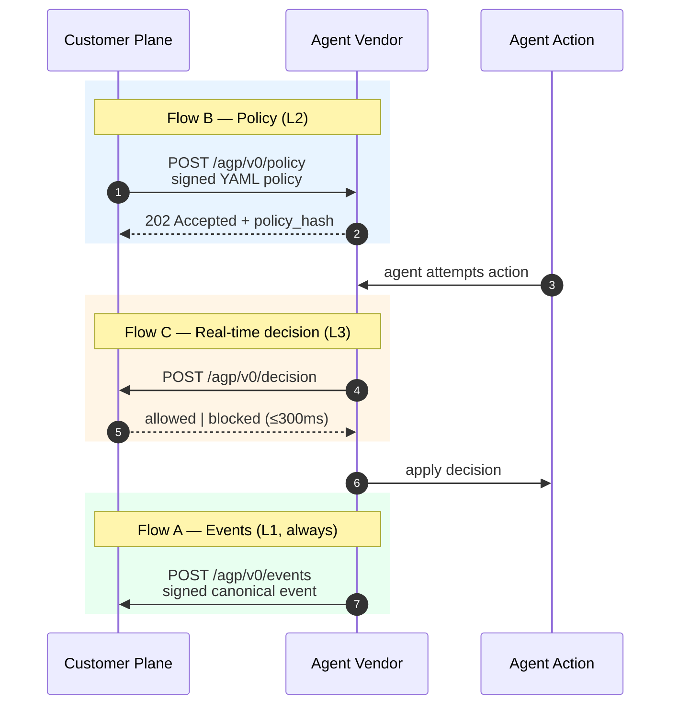

<div align="center">

<picture>
  <source media="(prefers-color-scheme: dark)" srcset="https://raw.githubusercontent.com/openagp/.github/main/profile/assets/banner-dark.svg">
  <source media="(prefers-color-scheme: light)" srcset="https://raw.githubusercontent.com/openagp/.github/main/profile/assets/banner-light.svg">
  
</picture>

<br>

[](https://github.com/openagp/spec/blob/main/concept-and-spec.md)
[](https://pypi.org/project/openagp/)
[](https://www.npmjs.com/package/@openagp/sdk)
[](https://creativecommons.org/licenses/by/4.0/)
[](https://www.apache.org/licenses/LICENSE-2.0)
[](https://github.com/openagp/spec#36-conformance-levels)
[](https://github.com/openagp/.github/blob/main/ROADMAP.md)

### **One protocol. Every vendor. One control plane.**

[Read the spec](https://github.com/openagp/spec/blob/main/concept-and-spec.md) · [Python SDK](https://github.com/openagp/sdk-python) · [TypeScript SDK](https://github.com/openagp/sdk-typescript) · [Conformance suite](https://github.com/openagp/cts) · [Registry](https://github.com/openagp/registry) · [Examples](https://github.com/openagp/examples)

</div>

---

<table>
<tr>
<td width="50%" valign="top">

### Without AGP

- N vendors × M customers = **N × M bespoke integrations**
- Audit logs in N incompatible formats
- Policy authored separately for every vendor
- No cryptographic provenance — "trust us, the agent did this"
- Compliance evidence assembled by hand, quarterly
- A single agent action across 3 vendors is **3 separate stories**

</td>
<td width="50%" valign="top">

### With AGP

- N vendors × M customers = **N + M integrations**
- One canonical event schema, signed end-to-end
- One policy DSL, pushed to every vendor
- Every event signed; ledger is hash-chained and verifiable
- Compliance evidence is a query, not an effort
- A single agent action is **one event with verifiable lineage**

</td>
</tr>
</table>

> **The way SAML standardized "who is this user," and MCP standardized "what tools can an agent call" — AGP standardizes "what is this agent allowed to do, who said so, and what did it actually do" across every AI agent vendor.**

---

## How it works

AGP defines three flows between a customer's **governance plane** and an agent **vendor**. A vendor implements one or more — declaring its conformance level (**L1**, **L2**, or **L3**) — and the same policy works everywhere.



Events are signed Ed25519. Policies are signed Ed25519. The plane verifies every signature against the **AGP Registry** of public keys before it trusts a single byte. The customer's ledger becomes a **cryptographic chain of agent action** — auditable, replayable, and impossible to forge without compromising a registered key.

---

## Conformance levels

<table>
<tr>
  <th width="80px" align="center">Level</th>
  <th>Vendor implements</th>
  <th>What the customer gets</th>
  <th align="center">Cost to ship</th>
</tr>
<tr>
  <td align="center"><b>L1</b><br><sub>events</sub></td>
  <td>Flow A — emit signed canonical events</td>
  <td>Passive observability. Every agent action recorded with verifiable provenance.</td>
  <td align="center"><sub>≤ 1 eng-week</sub></td>
</tr>
<tr>
  <td align="center"><b>L2</b><br><sub>governance</sub></td>
  <td>Flow A + Flow B — accept and apply customer policy</td>
  <td>Customer-authored policy enforced inside the vendor. One policy, all vendors.</td>
  <td align="center"><sub>+ 1 eng-week</sub></td>
</tr>
<tr>
  <td align="center"><b>L3</b><br><sub>real-time</sub></td>
  <td>Flow A + Flow B + Flow C — synchronous decision callback</td>
  <td>High-stakes actions gated by the customer plane in &lt;300ms. Human-in-the-loop becomes a protocol primitive.</td>
  <td align="center"><sub>+ 2 eng-weeks</sub></td>
</tr>
</table>

Vendors advertise their level via a `.well-known/agp` discovery document. Customers pin minimum levels in procurement.

---

## The repos

<table>
<tr>
<td width="50%" valign="top">

#### 📜  Protocol

[**`openagp/spec`**](https://github.com/openagp/spec) — protocol specification, JSON Schemas, fixtures
<br><sub>v0.1 working draft · 6 schemas · 23 cross-language test vectors</sub>

[**`openagp/registry`**](https://github.com/openagp/registry) — public directory of compliant actors and their public keys
<br><sub>open for first actor submissions</sub>

</td>
<td width="50%" valign="top">

#### 🛠️  Reference implementations

[**`openagp/sdk-python`**](https://github.com/openagp/sdk-python) — Python SDK · `pip install openagp`
<br><sub>v0.0.1 · sign + verify + policy DSL evaluator</sub>

[**`openagp/sdk-typescript`**](https://github.com/openagp/sdk-typescript) — TypeScript SDK · `npm i @openagp/sdk`
<br><sub>v0.0.1 · sign + verify + policy DSL evaluator</sub>

[**`openagp/cts`**](https://github.com/openagp/cts) — Conformance Test Suite (`agp-cts`)
<br><sub>v0.1 · static Go binary · embedded vectors</sub>

[**`openagp/examples`**](https://github.com/openagp/examples) — end-to-end worked examples
<br><sub>acme-walkthrough runnable end-to-end</sub>

</td>
</tr>
</table>

---

## Quick start

<table>
<tr>
<td width="33%" valign="top">

### 🏢 I'm a vendor

Ship L1 in **&lt;1 engineer-week**:

```python
from openagp.events import Event, sign

event = Event(
  actor={"vendor": "acme.com",
         "agent_id": "agt_42"},
  action={"type": "tool_call",
          "tool_name": "browser.navigate"},
)
plane_client.emit(sign(event, key))
```

Then validate:

```bash
agp-cts validate-vendor \
  --endpoint https://api.acme.com/agp/v0/
```

Submit your registry entry with the signed conformance report.

</td>
<td width="33%" valign="top">

### 🛡️ I'm a customer

Author one policy. It works everywhere:

```yaml
agp_policy_version: "0.1"
applies_to:
  vendors: ["*"]
rules:
  - id: rule_pii_outbound
    when:
      action.type: tool_call
      action.input_summary:
        contains_pattern: "ssn|email"
    then:
      decision: blocked
      reason: "PII outbound"
```

Every event is stamped with `policy_hash` so you can prove which policy was in force.

</td>
<td width="33%" valign="top">

### 🤝 I want to contribute

Read [GOVERNANCE.md](https://github.com/openagp/.github/blob/main/GOVERNANCE.md) and [CONTRIBUTING.md](https://github.com/openagp/.github/blob/main/CONTRIBUTING.md).

```bash
# DCO sign-off; no CLA
git commit -s -m "..."
```

Best places to start:
- File RFCs on [`spec`](https://github.com/openagp/spec/issues)
- PR test cases to [`cts`](https://github.com/openagp/cts)
- Add your registry entry
- Author worked examples

</td>
</tr>
</table>

---

## Roadmap

<table>
<tr>
  <th>Quarter</th><th>Milestone</th><th align="center">Status</th>
</tr>
<tr><td><b>Q2 2026</b></td><td>Spec v0.1 + Python/TypeScript SDKs + CTS published</td><td align="center">✅ shipped (rc.1)</td></tr>
<tr><td>Q3 2026</td><td>First customer deployments use AGP under the hood</td><td align="center">⚪ pending</td></tr>
<tr><td>Q4 2026</td><td>Registry entries co-authored with at least 2 model vendors</td><td align="center">⚪ pending</td></tr>
<tr><td>Q1 2027</td><td>Working group formed (1 plane + 2 vendors + 2 customers + 1 academic)</td><td align="center">⚪ pending</td></tr>
<tr><td>Q1 2027</td><td>First customer RFP requires "AGP L1 conformance"</td><td align="center">⚪ pending</td></tr>
<tr><td>Q2 2027</td><td>Spec v0.2 — formal DSL grammar, working-group feedback</td><td align="center">⚪ pending</td></tr>
<tr><td>Q3 2027</td><td>First non-reference plane implementation</td><td align="center">⚪ pending</td></tr>
<tr><td><b>2028</b></td><td>AGP becomes the default expectation in regulated procurement</td><td align="center">⚪ pending</td></tr>
</table>

Detailed sequencing: [§5 of the spec](https://github.com/openagp/spec/blob/main/concept-and-spec.md#5-adoption-strategy).

---

## Governance — honest disclosure

<table>
<tr>
<td valign="top" width="60%">

OpenAGP is initially developed and stewarded by **[Zeron](https://securezeron.com)** — the company behind ZAK, the canonical reference implementation of an AGP plane. Zeron created AGP because the fragmentation of agent governance is a problem its customers face directly, and because **no incumbent** — hyperscaler, foundation model vendor, or compliance vendor — **is structurally positioned to ship a vendor-neutral protocol.**

The explicit roadmap is to transfer governance to a vendor-neutral working group by **v1.0**. Single-vendor stewardship today; multi-stakeholder governance tomorrow. Candidate permanent homes: Linux Foundation, OpenSSF, OASIS, IETF — to be selected by the working group.

We are transparent about this rather than pretending neutrality on day one.

</td>
<td valign="top" width="40%">

#### Stewardship phases

```
TODAY  ─►  Q1 '27  ─►  v1.0
 │           │            │
 │           │            └─ Foundation
 │           │               (LF / OpenSSF / OASIS / IETF)
 │           │
 │           └─ Working group
 │              (1 + 2 + 2 + 1)
 │
 └─ Zeron-led
    open contribution
```

Read: [**GOVERNANCE.md** ↗](https://github.com/openagp/.github/blob/main/GOVERNANCE.md)

</td>
</tr>
</table>

---

## License

| Component | License | Why |
|---|---|---|
| Spec text and JSON Schemas | [**CC BY 4.0**](https://creativecommons.org/licenses/by/4.0/) | Free to share and adapt — only requires attribution |
| SDKs and CTS | [**Apache-2.0**](https://www.apache.org/licenses/LICENSE-2.0) | Permissive code license with explicit patent grant |
| Registry data | [**CC0**](https://creativecommons.org/publicdomain/zero/1.0/) | Public-domain index; signed claims inside are still authored by their submitters |

---

<div align="center">

### Get involved

[**Read the spec**](https://github.com/openagp/spec/blob/main/concept-and-spec.md) · [Open an RFC](https://github.com/openagp/spec/issues/new) · [Implement L1](https://github.com/openagp/sdk-python) · [Add a registry entry](https://github.com/openagp/registry)

<br>

<sub><b>OpenAGP</b> — open spec  ·  vendor-neutral  ·  cryptographically verifiable  ·  enforceable in production</sub>
<br>
<sub>Reach the maintainers: <a href="mailto:hello@openagp.io">hello@openagp.io</a></sub>

</div>
